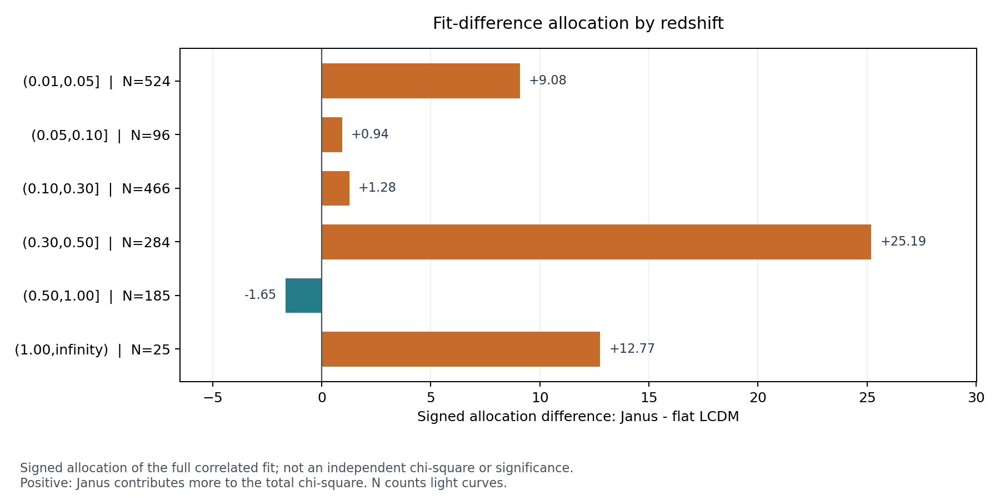

# Janus and Pantheon+ results

Results of a comparative fit of the Janus supernova distance law and flat LCDM,
followed by an exploratory investigation of where their fit difference arises.
Author: Téo Alletz. Updated 8 October 2026.

**This repository publishes the results report and figures. The implementation
is private; access can be requested below.**

## Main result

On the selected Pantheon+ sample of **1580 light curves representing 1466 distinct
objects**, the frozen Janus curve has a chi-square **47.620 higher than flat
LCDM** using the full statistical and systematic covariance. Lower is better.
An independent implementation reproduces this difference.

| Comparison | Janus minus flat LCDM chi-square |
|---|---:|
| Full selected sample | +47.620 |
| After removing the 284 records with 0.30 < zHD <= 0.50 | +21.172 |
| After removing the eight CANDELS records | +32.638 |
| After removing the 269 PS1MD records | +31.774 |

The deletion rows hold the cosmological shape parameters fixed and recalculate
only the additive offsets. They are diagnostic checks, not new best-fit
comparisons. None of the 46 prescribed single-group deletions reverses the
positive gap under those conditions.

The discrepancy is not confined to the most distant objects. Its allocation
does not establish an instrumental fault or a physical cause. This comparison
does not validate or refute an entire cosmological framework.

**Read the [complete results report](REPORT.md)** for all 26 groups, all 46
deletion controls, the numerical checks and the limitations. The
[analysis protocol](PROTOCOL.md) was recorded before grouped outcomes were
calculated; the full-sample gap was already known.

The signed allocations share covariance cross terms. They are not independent
chi-squares, local significances or causal percentages.

## Request code access

The source code, tests and machine-readable audit files are held in a separate
private repository. To request access,
**[open a code access request](https://github.com/Flasher1717/janus-pantheon-results/issues/new?title=Code%20access%20request)**
and state your GitHub username and intended use. Requests are reviewed manually;
opening a request does not automatically grant access. Do not include sensitive
information in a public issue.

Public source data remain available from the
[Pantheon+ and SH0ES release](https://github.com/PantheonPlusSH0ES/DataRelease).

## Validation status

The independent checks of the frozen curves and all allocation/deletion gates
pass. During publication, the new Linux test using the real datasets exposed an
arithmetic sensitivity in the historical curvature uncertainty and two last-digit
reference values. A documented erratum was explicitly authorized on 8 October;
the historical values are retained and test tolerances are unchanged. The report
documents the issue; the independently verified
frozen-curve gap and the localization tables remain the results reported here.

After the correction, **113 local tests passed** with one documented XPASS, and
**all five GitHub CI jobs passed**, including the Pantheon+/JLA real-data job and
the Linux/Windows Python 3.12/3.14 matrix. The implementation retains the original
scientific tolerances and archives the historical reference values.

## Contributors

- **Téo Alletz** — project author, direction and review.
- **Claude Code (Anthropic)** — assistance with the initial implementation,
  Pantheon+ analysis, controlled JLA extension and original scientific report.
- **OpenAI Codex** — assistance with the October 2026 review, independent
  numerical checks, discrepancy localization, approved numerical erratum and
  publication of this results report.

Claude's original contribution is retained alongside Codex's subsequent work.
The work includes explicit numerical cross-checks. This is a project report,
not a claim of peer review or a new law of physics.
