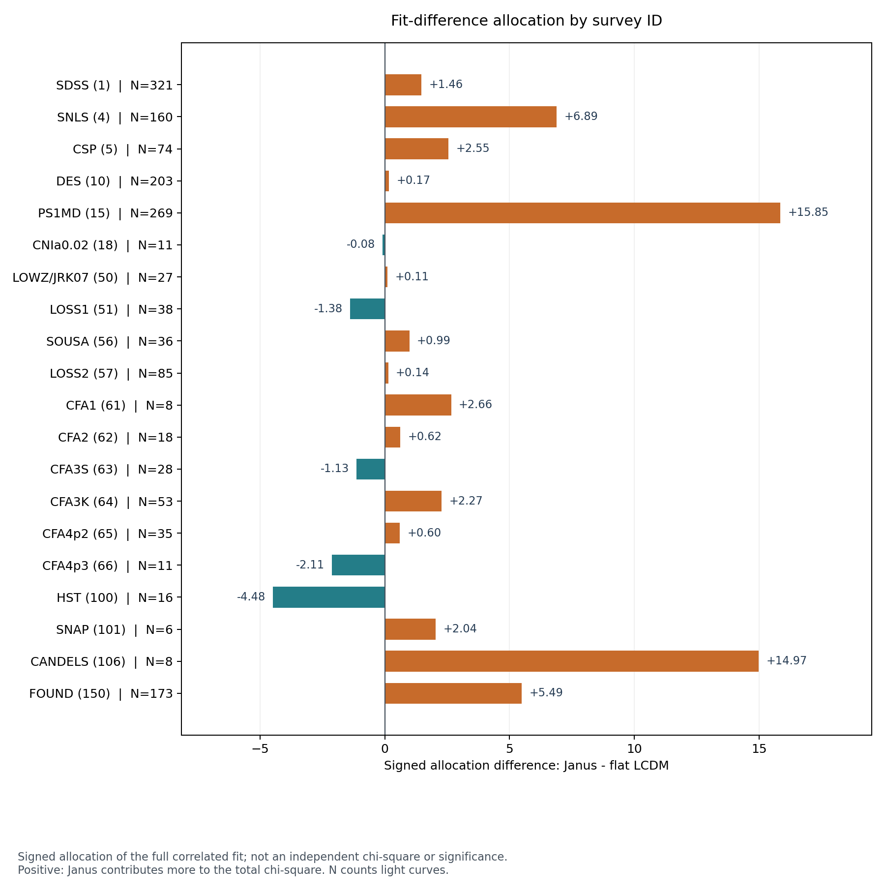
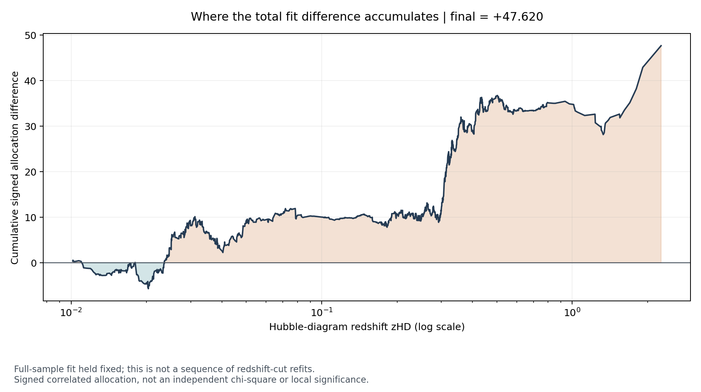
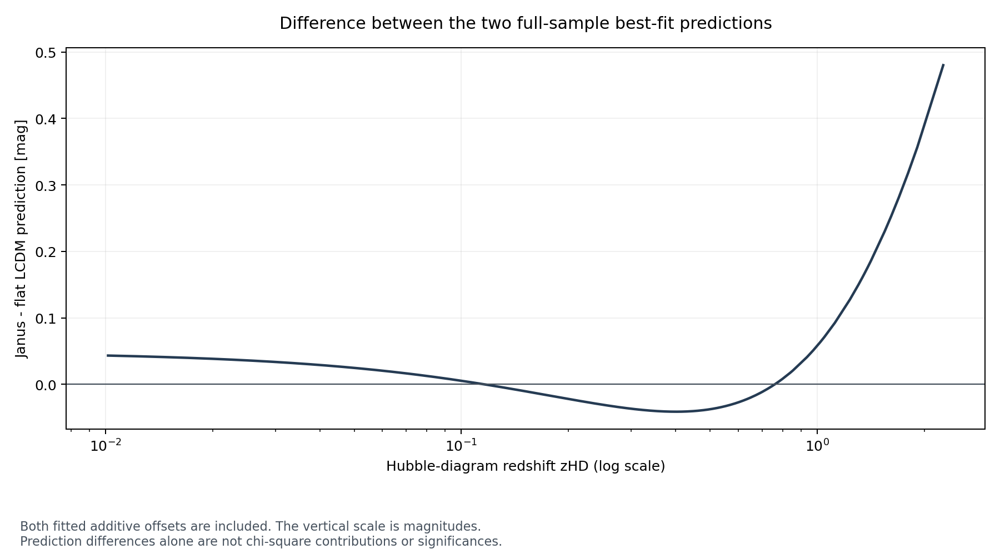

# Pantheon+ discrepancy localization

The frozen Janus distance law has a chi-square **47.619565 above flat LCDM** on
1580 selected Pantheon+ light curves representing 1466 distinct CID. A separately
implemented numerical oracle reproduces this result. The largest signed
allocation among the six specified redshift bins is **+25.194494 at
0.30 < zHD <= 0.50**. In the separate survey partition, PS1MD and CANDELS have
allocations of **+15.845914** and **+14.972220**. These partitions overlap and their
allocations must not be added together.

Every prescribed single-group deletion leaves a positive gap when both
cosmological shape parameters remain fixed and the additive offsets are
recomputed. This localizes the discrepancy within the adopted likelihood; it
does not identify a faulty survey or a physical cause.

Date: 2026-10-08. Protocol: [PROTOCOL.md](PROTOCOL.md),
committed at `2967bc0` before any grouped outcome was calculated or inspected.
The total gap and previous full-sample residual figure were already known.
This is a prespecified exploratory follow-up on reused data, not independent
confirmatory evidence. Project author: Téo Alletz. **Claude Code (Anthropic)**
assisted with the original implementation, Pantheon+ analysis, controlled JLA
extension and report. **OpenAI Codex** assisted with the October review,
independent checks, discrepancy localization, numerical erratum and publication.
Both contributions are acknowledged; the earlier Claude-assisted work is retained.

## Independent numerical verification

The oracle parses the raw table and covariance independently, evaluates flat
LCDM through adaptive quadrature and Janus equation 29 through 50-digit Decimal
arithmetic, and uses generic dense linear solves to profile each additive offset
and evaluate the centered quadratic form. Production calculations are imported
only afterward for comparison. This verifies the implementation of the adopted
equations, not their physical derivation or completeness.

| Check | Measured value | Required limit |
|---|---:|---:|
| Flat LCDM chi-square, oracle | 1387.098995952116 | Frozen 1387.099 +/- 0.001 |
| Janus chi-square, oracle | 1434.718560570553 | Frozen 1434.719 +/- 0.001 |
| Janus minus LCDM, oracle | 47.619564618437 | Frozen 47.620 +/- 0.002 |
| Maximum distance-modulus difference, each model | 7.11e-15 mag | 1e-10 mag |
| Chi-square difference from production likelihood, LCDM | 5.41e-9 | 1e-6 |
| Chi-square difference from production likelihood, Janus | 2.45e-8 | 1e-6 |
| L1 difference of all signed row allocations | 1.15e-10 | 1e-6 |
| Production allocation sum minus full gap, absolute | 2.56e-13 | 1e-8 |

Selected row indices and the numerical input arrays agree exactly in this run.
Independent float parsers are allowed only an eight-machine-epsilon scaled
roundoff difference; it is zero here. Both complete partitions recover the full
gap within 1e-8. All 46 deletion checks satisfy nonnegative reduced scores and
reduced scores no larger than the corresponding full-sample scores, within the
fixed tolerances. The full-precision numerical audit and machine-readable tables
are available with the implementation on request; input hashes are listed below.

The shape parameters are the frozen rounded references, Omega_m = 0.331631 and
q0 = -0.021010. H0 = 70 km/s/Mpc is absorbed by the profiled additive offsets,
which are -19.351407732219 for LCDM and -19.302857311209 for Janus. No shape
minimization or new uncertainty estimation was performed.

## What the allocation measures

For each model, let r be the full-sample residual after profiling its offset and
solve C w = r with the full STAT+SYS covariance. The signed allocation is

    a_i = r_J,i w_J,i - r_L,i w_L,i

Its sum is the full chi-square difference. With symmetric precision, cross terms
are shared equally between endpoints. Consequently a group allocation is not
an independent chi-square, likelihood-ratio statistic, local significance or
causal percentage. Negative values are allowed. Redshift and survey are two
separate complete partitions of the same records.

Deletion asks a different question: after removing a group, evaluate the same
two shapes with the retained principal covariance C_HH and reprofile their
offsets. The remaining gap is not a new best-fit comparison. Deletion changes
are nonadditive and need not have the same sign as allocations.

## Redshift results

All six bins were fixed in the protocol. N counts light-curve records, not
necessarily distinct objects. Positive allocation increases the full Janus minus
LCDM score; positive deletion change means that deleting the group reduces it.

| zHD interval | N | Distinct CID | Signed allocation | Gap after deletion | Gap change |
|---|---:|---:|---:|---:|---:|
| (0.01, 0.05] | 524 | 416 | +9.084 | +35.532 | +12.088 |
| (0.05, 0.10] | 96 | 90 | +0.939 | +46.208 | +1.412 |
| (0.10, 0.30] | 466 | 466 | +1.281 | +48.724 | -1.105 |
| (0.30, 0.50] | 284 | 284 | +25.194 | +21.172 | +26.448 |
| (0.50, 1.00] | 185 | 185 | -1.649 | +46.194 | +1.426 |
| (1.00, infinity) | 25 | 25 | +12.770 | +35.691 | +11.929 |

The intermediate-redshift bin 0.30 < zHD <= 0.50 has the largest allocation and
largest deletion sensitivity among the fixed bins. The discrepancy therefore
does not arise solely from the most distant objects. Removing that bin still
leaves +21.172 with the frozen curves.

The bin 0.50 < zHD <= 1.00 illustrates why allocation and deletion are distinct:
its allocation is negative, but its deletion decreases the full gap by +1.426.
Correlations and recomputation of the offsets make this possible. This result
does not establish that Janus independently fits that bin better.


## Survey results and duplicate-object controls

All 20 IDSURVEY categories present in the selected sample are shown in numeric
ID order, with names from the official release. These categories are not silently
merged into the paper's survey count. Each survey has one selected record per
CID internally; some CID occur across surveys.

Record deletion removes only the named survey's rows. CID-closed deletion also
removes every other selected record of any CID in that survey. Extra N is this
collateral removal; the CID-closed sets overlap and cannot be combined additively.
The two gap columns below cover all 40 prescribed survey deletion runs.

| Survey and ID | N | Signed allocation | Gap after record deletion | Extra N for CID closure | Gap after CID-closed deletion |
|---|---:|---:|---:|---:|---:|
| SDSS (1) | 321 | +1.462 | +47.249 | 0 | +47.249 |
| SNLS (4) | 160 | +6.890 | +40.457 | 0 | +40.457 |
| CSP (5) | 74 | +2.550 | +45.737 | 61 | +46.619 |
| DES (10) | 203 | +0.168 | +46.789 | 0 | +46.789 |
| PS1MD (15) | 269 | +15.846 | +31.774 | 0 | +31.774 |
| CNIa0.02 (18) | 11 | -0.080 | +47.738 | 0 | +47.738 |
| LOWZ/JRK07 (50) | 27 | +0.108 | +48.290 | 3 | +47.468 |
| LOSS1 (51) | 38 | -1.382 | +49.422 | 24 | +47.409 |
| SOUSA (56) | 36 | +0.985 | +46.779 | 18 | +46.737 |
| LOSS2 (57) | 85 | +0.139 | +47.779 | 63 | +44.100 |
| CFA1 (61) | 8 | +2.661 | +45.409 | 0 | +45.409 |
| CFA2 (62) | 18 | +0.618 | +47.447 | 8 | +46.689 |
| CFA3S (63) | 28 | -1.128 | +48.229 | 15 | +46.282 |
| CFA3K (64) | 53 | +2.273 | +44.680 | 48 | +42.018 |
| CFA4p2 (65) | 35 | +0.596 | +46.711 | 28 | +45.999 |
| CFA4p3 (66) | 11 | -2.108 | +49.982 | 2 | +49.932 |
| HST (100) | 16 | -4.476 | +51.744 | 0 | +51.744 |
| SNAP (101) | 6 | +2.040 | +45.815 | 0 | +45.815 |
| CANDELS (106) | 8 | +14.972 | +32.638 | 0 | +32.638 |
| FOUND (150) | 173 | +5.486 | +38.612 | 0 | +38.612 |

PS1MD has the largest survey allocation. Its 269 records span zHD = 0.02517 to
0.61983. Removing them reduces the fixed-shape gap by +15.846.

CANDELS has only eight records, spanning zHD = 1.32910 to 2.26137, but a large
allocation of +14.972. Removing them leaves +32.638. This makes that set worth
examining in a separately specified follow-up; it does not establish eight
outliers or a calibration problem. The HST (100) category has a negative
allocation, so a blanket statement that all distant surveys favor LCDM would
also misrepresent the result.

Duplicate-object handling matters for some low-redshift surveys. For example,
LOSS2 record deletion leaves +47.779, whereas removal of the same 85 CID across
all surveys removes 148 records and leaves +44.100. Both results must remain
visible; neither defines independent survey evidence.



## Full-sample curves

The cumulative allocation is summed in increasing redshift with equal redshifts
aggregated. It describes the fixed full-sample fit and is not a sequence of fits
with progressively changed redshift cuts.



The prediction difference includes both globally profiled additive offsets.
Its shape helps explain where the two adopted curves differ, but its amplitude
alone is not a significance or a measure of fit to the observed data.



## Interpretation and next scientific question

Confidence is high in the numerical reproduction and in these conditional
allocations: separate formulas, parsers and solvers agree far inside the fixed
thresholds. Physical attribution remains unresolved. Survey coverage and
redshift are confounded, calibration uncertainties are shared, and this analysis
uses the adopted standardized magnitudes and covariance.

The useful next question is whether the intermediate-redshift discrepancy and
the CANDELS sensitivity persist under a separately specified comparison that
refits the shape parameters and explicitly checks the relevant observational
assumptions. Such a study needs its own criteria before computing results and
should retain the full sample as its main comparison. The present diagnostic
does not justify removing a survey to improve a preferred model.

No new physical law, cosmological validation, formal theorem, p-value or
literature novelty is established here. The concrete new project result is a
reproducible map of the existing discrepancy and a numerical control of its
implementation. AI-assisted mathematics and physics provide methods for such
checks, not additional observational support for either cosmology.

## Reproduction and access

The source code, tests, full-precision CSV/JSON audit and reproducibility
instructions are kept in a separate private implementation repository.
[Request access](https://github.com/Flasher1717/janus-pantheon-results/issues/new?title=Code%20access%20request)
with your GitHub username and intended use. Access is reviewed manually.

The implementation verifies input hashes, runs the independent oracle before
grouped calculations, and checks all frozen-score, conservation and deletion
gates. Calculations are deterministic, offline after data acquisition and require
no random seed. Historical chains and figures are preserved.

Available audit files contain the full scores and offsets, all 26 groups, all
46 deletion runs, and all 1580 records with source indices, CID, survey,
predictions, residuals and allocations. The row-level file is an audit record,
not a rejection list.

## Validation and publication note

At the diagnostic's local completion, **110 tests passed, one existing documented
XPASS, zero skipped**. Eighteen new synthetic tests cover the diagnostic algebra,
shifts, permutation, correlated allocations, covariance restriction and input
validation. Ruff lint and format passed; strict Pyright reported zero errors
and warnings. All four PNG files were inspected.

On 2026-10-08, the first GitHub run with real data passed 109 tests and the
documented XPASS but failed the strict reproduction test for the historical
Janus curvature uncertainty. All four Linux/Windows checks without those data
passed. Investigation identified cancellation in the historical evaluation of
the profiled chi-square as A - B squared / E. Centering the residual before the
quadratic form avoids that cancellation and exposes last-digit discrepancies
in two historical references: LCDM Omega_m and the Janus curvature uncertainty.

An independent calculation using analytic derivatives finds approximately
Omega_m = 0.331629025 and Janus sigma = 0.014768961, compared with the historical
0.331631 and 0.014767. Téo Alletz explicitly authorized the documented erratum
on 2026-10-08. The historical references are retained alongside separately named
corrected references; the same test tolerances are kept. The failing
publication check is not presented as successful.

After the approved correction, the local suite passed **113 tests plus the
documented XPASS, with zero skipped**, and Ruff lint/format and strict Pyright
passed. All five GitHub CI jobs then passed on the corrected commit, including
the test with real Pantheon+/JLA data and the Linux/Windows Python 3.12/3.14
matrix. A renewed independent oracle check agreed with the centered production
chi-squares within 6.82e-13. These later successful checks do not erase the
initial failure or the reason for the erratum.

The present report concerns the fixed, explicitly stated curve parameters.
Its independent oracle and centered allocation calculations already avoid that
cancellation and pass their prescribed gates. The full gap remains +47.620 at
the reported precision. This numerical issue does not supply a physical
explanation for the cosmological fit difference.

Environment: Windows 11 build 26200; Python 3.14.3; NumPy 2.4.6; SciPy 1.17.1;
pandas 3.0.3; Astropy 7.2.0; Matplotlib 3.10.9; pytest 9.0.3; Ruff 0.15.16;
Pyright 1.1.410.

Input SHA256:

```text
Pantheon+SH0ES.dat
1cb0fc379ef066afdc2ffd1857681cc478024570d8a3eba284fb645775198cf8
Pantheon+SH0ES_STAT+SYS.cov
abf806d966485e64afdb359c87bffc0ecc00d05eff0a31ced66f247385df0fdc
```

## Sources

- [Pantheon+ distance release README](https://github.com/PantheonPlusSH0ES/DataRelease/blob/main/Pantheon%2B_Data/4_DISTANCES_AND_COVAR/README):
  survey-ID names and released data conventions, consulted 2026-10-08. The
  downloaded table/covariance bytes are pinned above; the online README can change.
- [Brout et al. 2022, arXiv v2](https://arxiv.org/html/2202.04077v2): covariance
  equations 5 and 7, likelihood equation 9, shared calibration in section III.2.1.
- [D'Agostini and Petit 2018](https://doi.org/10.1007/s10509-018-3365-3):
  adopted Janus supernova distance law, equation 29.
- [Petit, Margnat and Zejli 2024](https://doi.org/10.1140/epjc/s10052-024-13569-w):
  later presentation of the Janus framework used for the equation cross-check.

The public protocol preserves its original references to implementation paths;
those files are included in the material available on request. This public
edition retains the diagnostic tables and figures and adds the dated publication
note above. It contains no implementation source code.
